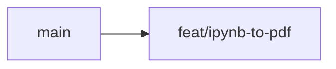
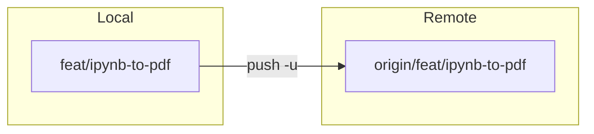
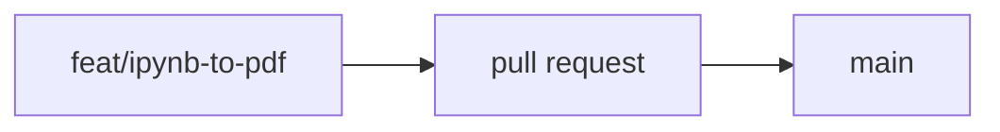
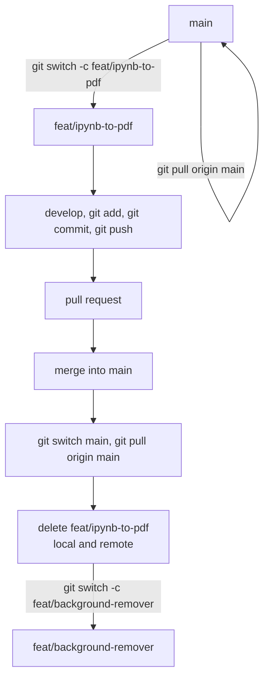
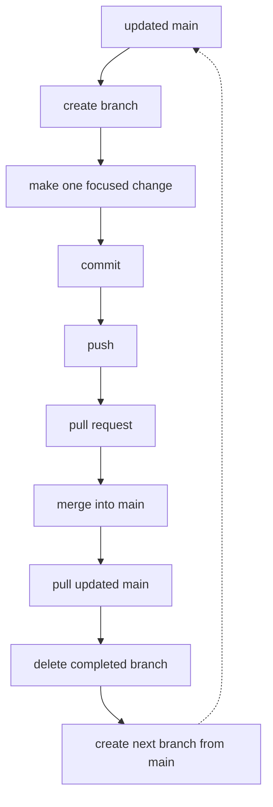

# Git Workflow

This document defines the recommended Git branching and commit workflow for this project.

## Branch naming

Use lowercase kebab case branch names.

### Feature branches

Use `feat/` for a new tool or user facing feature.

```text
feat/tool-name
```

Examples:

```text
feat/ipynb-to-pdf
feat/background-remover
feat/qr-generator
feat/video-editor
feat/regex-tester
```

For a larger feature containing multiple closely related changes:

```text
feat/pdf-converters
feat/image-converter-improvements
```

Prefer one tool or feature per branch whenever practical.

### Bug fix branches

Use `fix/` for bug fixes.

```text
fix/description
```

Examples:

```text
fix/pdf-download-error
fix/image-compression-crash
fix/mobile-upload-preview
fix/video-export-progress
```

### Claude changes

Use `claude/` when the branch contains work primarily created or modified through Claude.

```text
claude/description
```

Examples:

```text
claude/improve-pdf-processing
claude/fix-image-preview
claude/refactor-tool-layout
```

### Codex changes

Use `codex/` when the branch contains work primarily created or modified through Codex.

```text
codex/description
```

Examples:

```text
codex/add-video-thumbnail-extractor
codex/fix-pdf-worker
codex/refactor-file-processing
```

The branch prefix identifies the primary workflow or agent used. The branch name should still
clearly describe the actual change.

### Other maintenance branches

Use `chore/` for maintenance and project housekeeping.

```text
chore/description
```

Examples:

```text
chore/update-dependencies
chore/update-gitignore
chore/cleanup-unused-files
```

Use `docs/` for documentation only changes.

```text
docs/description
```

Examples:

```text
docs/update-git-workflow
docs/add-tool-contributing-guide
```

Use `refactor/` for code restructuring without adding a feature or fixing a specific bug.

```text
refactor/description
```

Examples:

```text
refactor/unify-image-converter
refactor/file-processing
```

### Branch prefix summary

| Prefix | Use for | Example |
| --- | --- | --- |
| `feat/` | New tool or feature | `feat/ipynb-to-pdf` |
| `fix/` | Bug fix | `fix/pdf-download-error` |
| `claude/` | Claude assisted work | `claude/improve-pdf-processing` |
| `codex/` | Codex assisted work | `codex/fix-pdf-worker` |
| `chore/` | Maintenance | `chore/update-dependencies` |
| `docs/` | Documentation only | `docs/update-git-workflow` |
| `refactor/` | Code restructuring | `refactor/unify-image-converter` |

## Standard feature workflow

Example: adding an IPYNB to PDF tool.

### Step 1. Update local main

Always start from the latest `main` branch.

```powershell
git switch main
git pull origin main
```

### Step 2. Create a feature branch

```powershell
git switch -c feat/ipynb-to-pdf
```



### Step 3. Develop and commit

Make the required changes and check the repository status.

```powershell
git status
git add .
git commit -m "feat: add ipynb to pdf converter"
```

### Step 4. Push the branch

Push the local branch to GitHub and configure the upstream branch.

```powershell
git push -u origin feat/ipynb-to-pdf
```



### Step 5. Create a pull request

Create a pull request and review the changes, then merge it into `main`.



### Step 6. Update local main after merge

After the pull request is merged:

```powershell
git switch main
git pull origin main
```

Local `main` is now synchronized with the merged remote branch.

### Step 7. Delete the completed branch

Deleting completed feature branches is recommended after the pull request has been merged.

**Delete local branch.** Make sure you are not currently on the branch being deleted.

```powershell
git branch -d feat/ipynb-to-pdf
```

If Git refuses because the branch has unmerged local commits, only use force deletion when you
are certain the work is no longer needed:

```powershell
git branch -D feat/ipynb-to-pdf
```

**Delete remote branch.** If GitHub did not automatically delete the branch after merging:

```powershell
git push origin --delete feat/ipynb-to-pdf
```

**Clean deleted remote references.**

```powershell
git fetch --prune
```

### Step 8. Start the next tool

Always create the next branch from the updated `main`.

```powershell
git switch -c feat/background-remover
```

### Complete example



## Commit message convention

Use a type prefix followed by a short description.

```text
type: description
```

Use lowercase descriptions and write them as concise statements.

### Feature

Use `feat:` for a new tool or user facing feature.

```text
feat: add ipynb to pdf converter
feat: add background remover
feat: add qr generator
```

### Fix

Use `fix:` for a bug fix.

```text
fix: resolve pdf download error
fix: prevent image preview crash
```

### Documentation

Use `docs:` for documentation changes.

```text
docs: add git workflow guide
docs: update tool documentation
```

### Maintenance

Use `chore:` for maintenance that does not directly add a feature or fix a user facing bug.

```text
chore: update dependencies
chore: remove unused files
```

### Refactoring

Use `refactor:` for restructuring existing code without changing intended functionality.

```text
refactor: unify image conversion logic
refactor: simplify file processing
```

### Commit prefix summary

| Prefix | Use for |
| --- | --- |
| `feat:` | New feature or tool |
| `fix:` | Bug fix |
| `docs:` | Documentation |
| `chore:` | Maintenance |
| `refactor:` | Code restructuring |

## Recommended daily workflow

For every new tool or feature:

```powershell
# 1. Update main
git switch main
git pull origin main

# 2. Create branch
git switch -c feat/tool-name

# 3. Develop and commit
git add .
git commit -m "feat: add tool name"

# 4. Push branch
git push -u origin feat/tool-name

# 5. Create and merge pull request on GitHub

# 6. Update local main
git switch main
git pull origin main

# 7. Delete completed local branch
git branch -d feat/tool-name

# 8. Clean deleted remote references
git fetch --prune

# 9. Start the next branch
git switch -c feat/next-tool-name
```

### Core rule



Keep branches focused, commits descriptive, and always start new work from the latest `main`.
